# `pygad.visualize` Module

The `pygad.visualize.plot.Plot` class is mixed into `pygad.GA`. Each method below is callable on a GA instance after `run()`.

Every method returns the `matplotlib.figure.Figure` it created and optionally writes it to disk via `save_dir`. A runnable script for each plot lives under [`examples/plots/`](https://github.com/ahmedfgad/GeneticAlgorithmPython/tree/master/examples/plots).

## Plot inventory

| Method | Works for | Needs `save_solutions=True` |
|---|---|---|
| `plot_fitness()` | SOO + MOO | no |
| `plot_new_solution_rate()` | SOO + MOO | yes |
| `plot_genes()` | SOO + MOO | yes (`solutions="all"`) or `save_best_solutions=True` (`solutions="best"`) |
| `plot_pareto_front_curve()` | MOO (M=2 or M=3) | no |
| `plot_pareto_front_pcp()` | MOO (any M >= 2) | no |
| `plot_pareto_front_scatter_matrix()` | MOO (any M >= 2; best for M >= 4) | no |
| `plot_pareto_front_heatmap()` | MOO (any M >= 2) | no |
| `plot_fitness_band()` | SOO + MOO | yes |
| `plot_non_dominated_hypervolume()` | MOO | yes |
| `plot_population_diversity()` | SOO + MOO | yes |
| `plot_pareto_front_evolution()` | MOO (M=2 or M=3) | yes |

Every method requires at least one completed generation. Each one raises `RuntimeError` with a clear message if it is called too early, on a single-objective problem when MOO is required, or without the `save_solutions` flag when one is required.

## `plot_fitness()`

Best fitness per generation. For MOO, one curve per objective on the same axes.

Parameters: `title`, `xlabel`, `ylabel`, `linewidth`, `font_size`, `plot_type` (`"plot"` / `"scatter"` / `"bar"`), `color`, `label`, `save_dir`.

```python
ga_instance.plot_fitness()
```

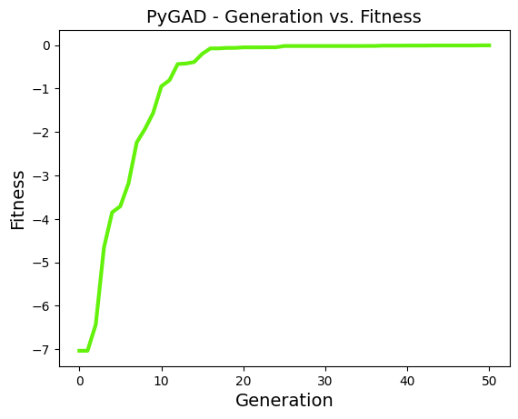

## `plot_new_solution_rate()`

Number of previously-unseen solutions per generation. A flat curve means the GA is repeating itself; a high curve means it is still exploring. Requires `save_solutions=True`.

Parameters: `title`, `xlabel`, `ylabel`, `linewidth`, `font_size`, `plot_type`, `color`, `save_dir`.

```python
ga_instance.plot_new_solution_rate()
```

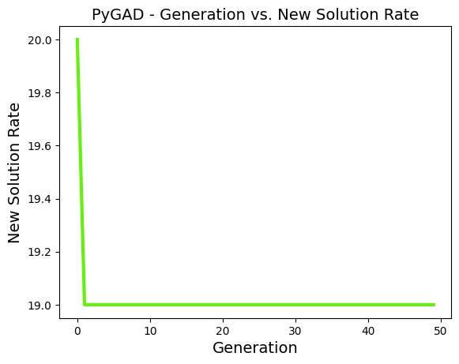

## `plot_genes()`

One subplot per gene showing how that gene drifts across generations. Three views: line per gene (`graph_type="plot"`), per-gene boxplot, per-gene histogram.

Use `solutions="all"` to plot every saved solution (needs `save_solutions=True`) or `solutions="best"` to plot only the best solution of each generation (needs `save_best_solutions=True`).

Parameters: `title`, `xlabel`, `ylabel`, `linewidth`, `font_size`, `plot_type`, `graph_type`, `fill_color`, `color`, `solutions`, `save_dir`.

```python
ga_instance.plot_genes(graph_type="boxplot")
```

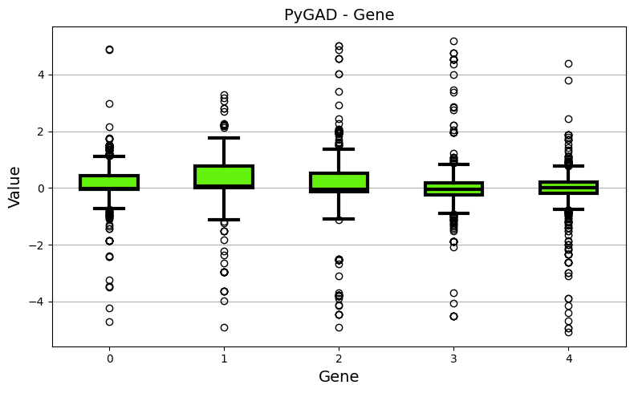

## `plot_pareto_front_curve()`

Pareto front of the final population. With 2 objectives it draws the population as a scatter and connects the non-dominated points with a curve. With 3 objectives it switches to a 3D scatter and highlights the non-dominated points. With 4 or more objectives it raises and points to the high-dimensional plots below.

Parameters: `title`, `xlabel`, `ylabel`, `zlabel` (only used for M=3), `linewidth`, `font_size`, `label`, `color`, `color_fitness`, `grid`, `alpha`, `marker`, `save_dir`.

```python
ga_instance.plot_pareto_front_curve()
```

For M=2 (NSGA-II on ZDT1):

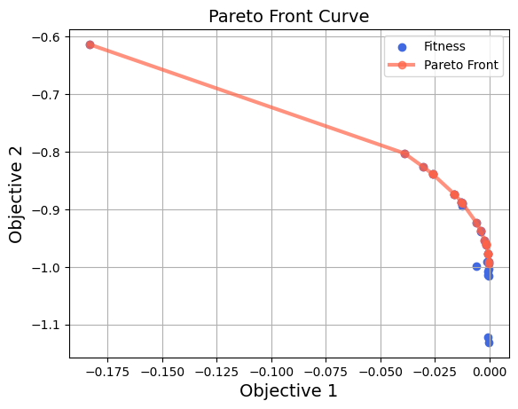

For M=3 (NSGA-III on DTLZ2):

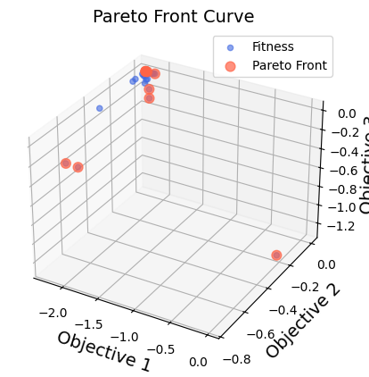

## `plot_pareto_front_pcp()`

Parallel-coordinates view of the final non-dominated set. Each objective is a vertical axis. Each non-dominated solution becomes a polyline that crosses every axis. Values are normalised per objective so very different scales remain comparable. Useful for any M >= 2 and especially for M >= 4.

Parameters: `title`, `xlabel`, `ylabel`, `linewidth`, `font_size`, `color`, `alpha`, `grid`, `save_dir`.

```python
ga_instance.plot_pareto_front_pcp()
```

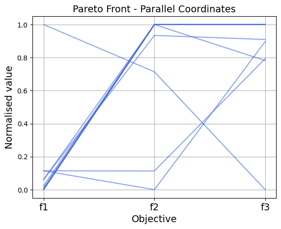

## `plot_pareto_front_scatter_matrix()`

M-by-M grid of pairwise scatter plots for the final non-dominated set. The diagonal shows a histogram of each objective. The best fit when M >= 4 and a single 3D scatter no longer reads well.

Parameters: `title`, `font_size`, `color`, `marker`, `alpha`, `grid`, `save_dir`.

```python
ga_instance.plot_pareto_front_scatter_matrix()
```

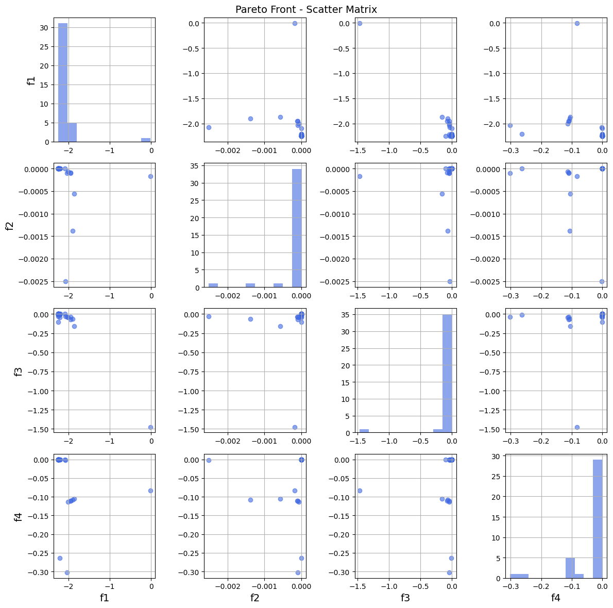

## `plot_pareto_front_heatmap()`

Heatmap of the final non-dominated set. Rows are solutions, columns are objectives, colour is the raw objective value. Rows are sorted by objective `sort_by` (default `0`); pass `sort_by=None` to keep the original order.

Parameters: `title`, `xlabel`, `ylabel`, `font_size`, `cmap`, `sort_by`, `save_dir`.

```python
ga_instance.plot_pareto_front_heatmap(sort_by=0)
```

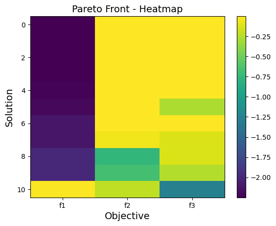

## `plot_fitness_band()`

Per-generation min, mean, and max with a shaded min-max band. Reveals selection pressure and diversity collapse at a glance. For MOO, pick one objective via `objective_index` (default `0`). Requires `save_solutions=True`.

Parameters: `title`, `xlabel`, `ylabel`, `font_size`, `color`, `band_alpha`, `linewidth`, `objective_index`, `grid`, `save_dir`.

```python
ga_instance.plot_fitness_band()
```

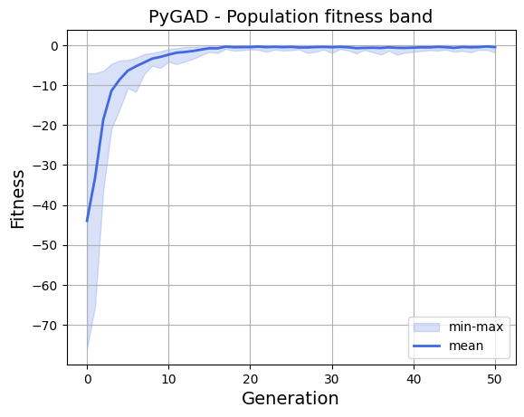

## `plot_non_dominated_hypervolume()`

Hypervolume of the non-dominated set per generation. Uses `pygad.utils.quality_indicators.hypervolume`. Pass `reference_point` explicitly, or let the method pick the column-wise min across all saved generations minus `0.1`. Requires `save_solutions=True`.

Parameters: `reference_point`, `title`, `xlabel`, `ylabel`, `font_size`, `color`, `linewidth`, `grid`, `save_dir`.

```python
ga_instance.plot_non_dominated_hypervolume()
```

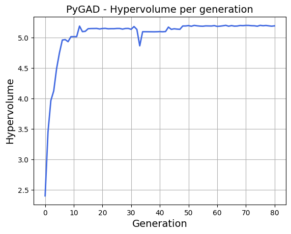

## `plot_population_diversity()`

Mean pairwise Euclidean distance between solutions per generation. A drop signals the population is converging or collapsing into duplicates. Requires `save_solutions=True`.

Parameters: `title`, `xlabel`, `ylabel`, `font_size`, `color`, `linewidth`, `grid`, `save_dir`.

```python
ga_instance.plot_population_diversity()
```

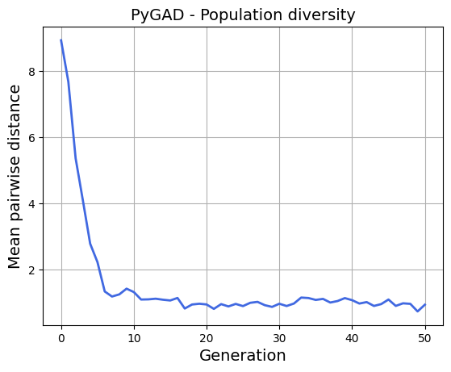

## `plot_pareto_front_evolution()`

Overlays the non-dominated set every `every_k` generations on a single figure. The colormap goes from early to late so you can see the front converge. Works for 2 or 3 objectives. Requires `save_solutions=True`.

Parameters: `every_k`, `title`, `xlabel`, `ylabel`, `zlabel`, `font_size`, `cmap`, `marker`, `alpha`, `grid`, `save_dir`.

```python
ga_instance.plot_pareto_front_evolution(every_k=20)
```

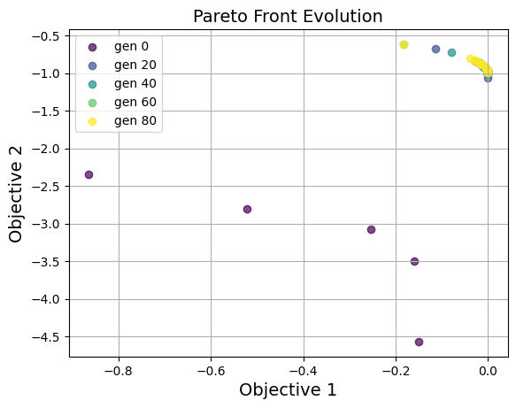
