# `pygad.visualize` Module

The `pygad.visualize.plot.Plot` class is mixed into `pygad.GA`. Each method below is callable on a GA instance after `run()`. `plot_lifecycle()` can also be called before `run()` because it draws the configured execution flow.

Every method returns the `matplotlib.figure.Figure` it created and optionally writes it to disk via `save_dir`. Complete scripts are linked below and listed in the [Examples index](examples.md).

## Plot inventory

| Method | Works for | Needs `save_solutions=True` |
|---|---|---|
| `plot_lifecycle()` | SOO + MOO, before or after `run()` | no |
| `plot_fitness()` | SOO + MOO | no |
| `plot_new_solution_rate()` | SOO + MOO | yes |
| `plot_genes()` | SOO + MOO | yes (`solutions="all"`) or `save_best_solutions=True` (`solutions="best"`) |
| `plot_pareto_front_curve()` | MOO (M=2 or M=3) | no |
| `plot_pareto_front_pcp()` | MOO (any M >= 2) | no |
| `plot_pareto_front_scatter_matrix()` | MOO (any M >= 2; best for M >= 4) | no |
| `plot_pareto_front_heatmap()` | MOO (any M >= 2) | no |
| `plot_fitness_band()` | SOO + MOO | yes |
| `plot_non_dominated_hypervolume()` | MOO | yes |
| `plot_population_diversity()` | SOO + MOO | yes |
| `plot_pareto_front_evolution()` | MOO (M=2 or M=3) | yes |

Except for `plot_lifecycle()`, every method requires at least one completed generation. Each one raises `RuntimeError` with a clear message if it is called too early, on a single-objective problem when MOO is required, or without the `save_solutions` flag when one is required.

After repeated `run()` calls, fitness plots, best-solution gene plots, and population diagnostics use the actual generation numbers. Histories retain both snapshots at a run boundary, so two points can have the same generation number. Population diagnostics also retain each snapshot's population size. `plot_new_solution_rate()` uses the latest saved population once per generation and excludes the final population, as in a single run. `plot_pareto_front_evolution(every_k=N)` selects actual generation numbers divisible by `N`, uses the latest snapshot at repeated boundaries, and always includes the final population. These plots also work in generated PDF reports.

(plot-lifecycle)=
## `plot_lifecycle()`

Draw the lifecycle configured for a GA instance: initial fitness evaluation, parent selection, crossover, mutation, population update, fitness reevaluation, and the generation loop. The chart includes the configured callbacks at their execution points, a generation-limit decision, and early stopping when a stopping criterion is set or `on_generation` can return `"stop"`.

```python
ga_instance.plot_lifecycle()
```

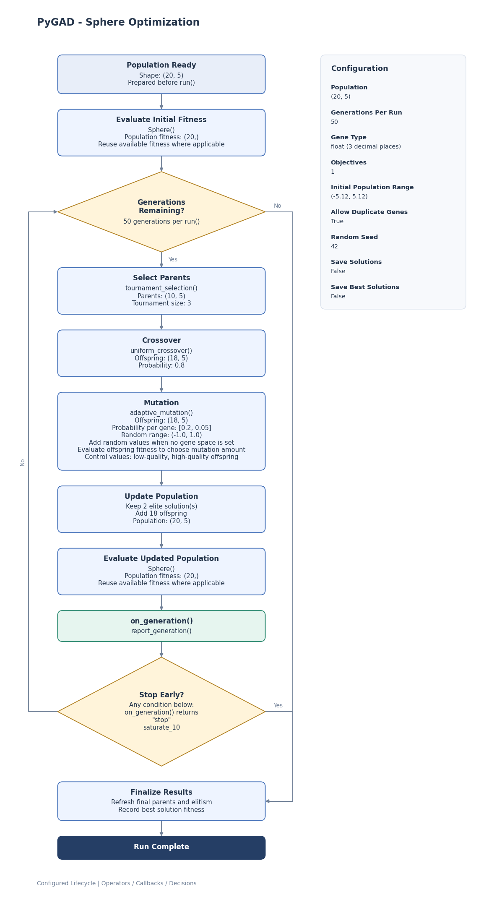

Operator cards show handler names, relevant probabilities, and parent or offspring shapes. The population update shows the effective retention policy: `keep_elitism` takes precedence over `keep_parents`. The configuration panel shows population size, generations per `run()`, gene types and precision, gene space or initialization range, constraints, and saving settings. Fitness batching and parallel processing appear when configured. Long gene configurations are abbreviated to keep the chart readable.

Callbacks appear only when supplied. If `crossover_type=None` or `mutation_type=None`, the corresponding operator card is omitted and the remaining stages are connected directly. Configured `on_crossover` and `on_mutation` callbacks still appear because they run even when the operator is disabled. Adaptive mutation includes its additional offspring fitness evaluation, and NSGA-III includes reference-point preparation. NSGA-III may grow the population during this preparation; shapes in a chart drawn before `run()` describe the current configuration.

In the detailed view, the `Stop Early?` block lists the configured `stop_criteria` and, when an `on_generation` callback is supplied, the possible condition `on_generation() returns "stop"`. Any one of these conditions ends the run. The chart does not analyze the callback's code or assume that it will return `"stop"`. The block is omitted when neither early stopping mechanism is configured. Built-in block and configuration titles capitalize the first letter of each word; method and handler names retain their original spelling.

Parameters: `title` (default `"PyGAD - Lifecycle"`), `font_size` (default `11`, finite and positive), `show_parameters` (default `True`), `save_dir` (default `None`), `show` (default `True`).

Use `show_parameters=False` for a compact chart that keeps handler names and control flow. Set `show=False` to create or save a chart without displaying it. The method always returns the figure, so it can be customized further.

```python
# Save a detailed chart. The filename extension selects SVG, PNG, or PDF.
fig = ga_instance.plot_lifecycle(title="PyGAD - Scheduling Optimization",
                                 save_dir="lifecycle.svg",
                                 show=False)

# Display a compact chart.
ga_instance.plot_lifecycle(show_parameters=False)
```

The method reads the current GA configuration without evaluating fitness, calling operators or callbacks, or changing GA state. It describes the configured flow rather than recording the path taken during a run. Before fitness is available, the objective count is marked as unknown. After a run, the chart can show the known objective count and fitness shape. Each `run()` call uses the configured generation count, including when continuing a previous run.

Install the optional plotting dependency with `pip install pygad[visualize]`.

:::{python-examples}
plots/example_plot_lifecycle.py
:::

## `plot_fitness()`

Best fitness per generation. For MOO, one curve per objective on the same axes.

Parameters: `title`, `xlabel`, `ylabel`, `linewidth`, `font_size`, `plot_type` (`"plot"` / `"scatter"` / `"bar"`), `color`, `label`, `save_dir`.

```python
ga_instance.plot_fitness()
```

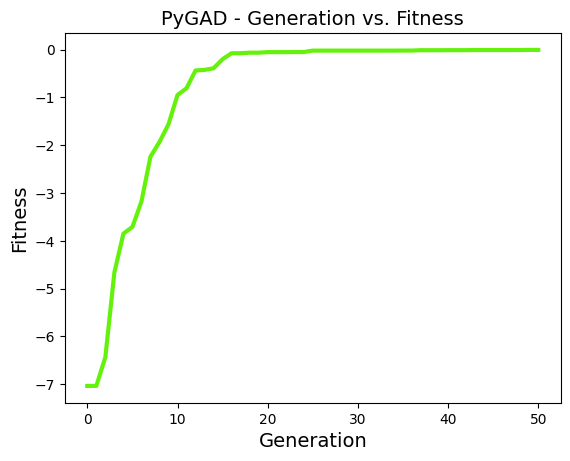

:::{python-examples}
plots/example_plot_fitness.py
:::

## `plot_new_solution_rate()`

Number of previously-unseen solutions per generation. A flat curve means the GA is repeating itself; a high curve means it is still exploring. Requires `save_solutions=True`.

Parameters: `title`, `xlabel`, `ylabel`, `linewidth`, `font_size`, `plot_type`, `color`, `save_dir`.

```python
ga_instance.plot_new_solution_rate()
```

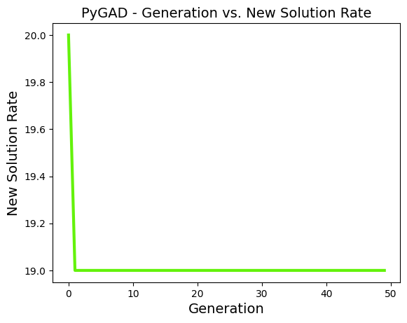

:::{python-examples}
plots/example_plot_new_solution_rate.py
:::

## `plot_genes()`

One subplot per gene showing how that gene drifts across generations. Three views: line per gene (`graph_type="plot"`), per-gene boxplot, per-gene histogram.

Use `solutions="all"` to plot every saved solution (needs `save_solutions=True`) or `solutions="best"` to plot only the best solution of each generation (needs `save_best_solutions=True`).

Parameters: `title`, `xlabel`, `ylabel`, `linewidth`, `font_size`, `plot_type`, `graph_type`, `fill_color`, `color`, `solutions`, `save_dir`.

```python
ga_instance.plot_genes(graph_type="boxplot")
```

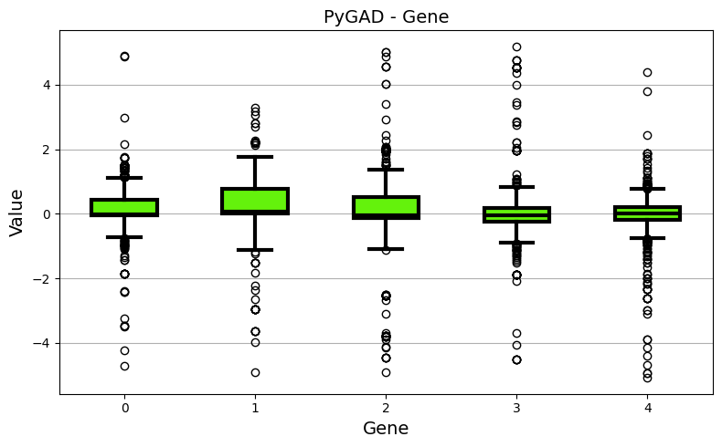

:::{python-examples}
plots/example_plot_genes.py
:::

## `plot_pareto_front_curve()`

Pareto front of the final population. With 2 objectives it draws the population as a scatter and connects the non-dominated points with a curve. With 3 objectives it switches to a 3D scatter and highlights the non-dominated points. With 4 or more objectives it raises and points to the high-dimensional plots below.

Parameters: `title`, `xlabel`, `ylabel`, `zlabel` (only used for M=3), `linewidth`, `font_size`, `label`, `color`, `color_fitness`, `grid`, `alpha`, `marker`, `save_dir`.

```python
ga_instance.plot_pareto_front_curve()
```

For M=2 (NSGA-II on ZDT1):

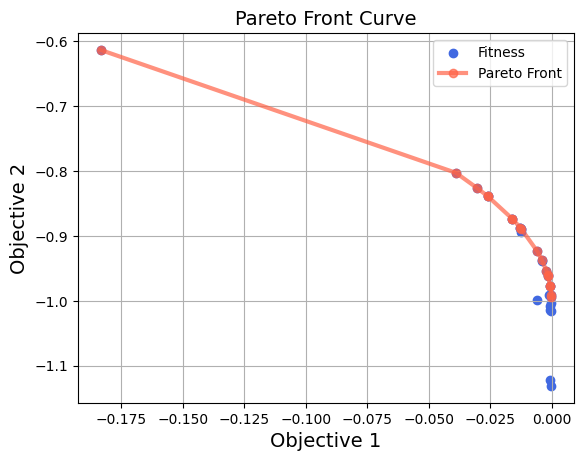

For M=3 (NSGA-III on DTLZ2):

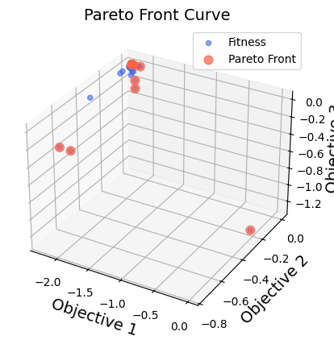

:::{python-examples}
plots/example_plot_pareto_front_curve_2d.py
plots/example_plot_pareto_front_curve_3d.py
:::

## `plot_pareto_front_pcp()`

Parallel-coordinates view of the final non-dominated set. Each objective is a vertical axis. Each non-dominated solution becomes a polyline that crosses every axis. Values are normalized per objective so very different scales remain comparable. Useful for any M >= 2 and especially for M >= 4.

Parameters: `title`, `xlabel`, `ylabel`, `linewidth`, `font_size`, `color`, `alpha`, `grid`, `save_dir`.

```python
ga_instance.plot_pareto_front_pcp()
```

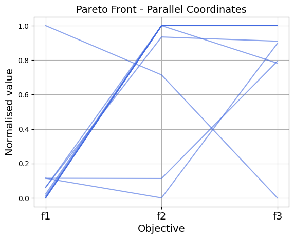

:::{python-examples}
plots/example_plot_pareto_front_pcp.py
:::

## `plot_pareto_front_scatter_matrix()`

M-by-M grid of pairwise scatter plots for the final non-dominated set. The diagonal shows a histogram of each objective. The best fit when M >= 4 and a single 3D scatter no longer reads well.

Parameters: `title`, `font_size`, `color`, `marker`, `alpha`, `grid`, `save_dir`.

```python
ga_instance.plot_pareto_front_scatter_matrix()
```

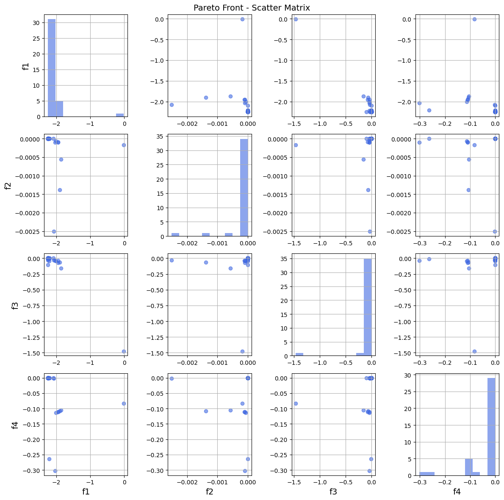

:::{python-examples}
plots/example_plot_pareto_front_scatter_matrix.py
:::

## `plot_pareto_front_heatmap()`

Heatmap of the final non-dominated set. Rows are solutions, columns are objectives, color is the raw objective value. Rows are sorted by objective `sort_by` (default `0`); pass `sort_by=None` to keep the original order.

Parameters: `title`, `xlabel`, `ylabel`, `font_size`, `cmap`, `sort_by`, `save_dir`.

```python
ga_instance.plot_pareto_front_heatmap(sort_by=0)
```

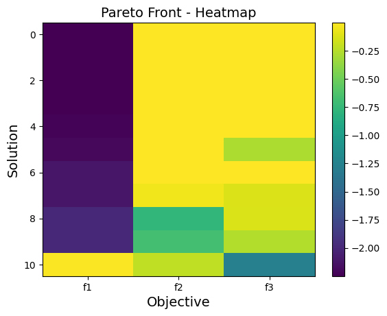

:::{python-examples}
plots/example_plot_pareto_front_heatmap.py
:::

## `plot_fitness_band()`

Per-generation min, mean, and max with a shaded min-max band. Reveals selection pressure and diversity collapse at a glance. For MOO, pick one objective via `objective_index` (default `0`). Requires `save_solutions=True`.

Parameters: `title`, `xlabel`, `ylabel`, `font_size`, `color`, `band_alpha`, `linewidth`, `objective_index`, `grid`, `save_dir`.

```python
ga_instance.plot_fitness_band()
```

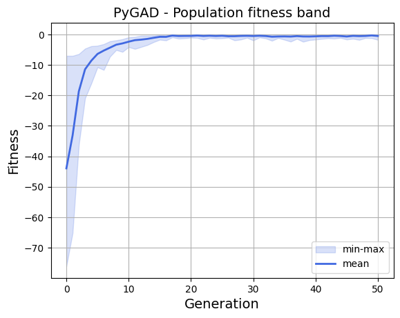

:::{python-examples}
plots/example_plot_fitness_band.py
:::

## `plot_non_dominated_hypervolume()`

Hypervolume of the non-dominated set per generation. Uses `pygad.utils.quality_indicators.hypervolume`. Pass `reference_point` explicitly, or let the method pick the column-wise min across all saved generations minus `0.1`. Requires `save_solutions=True`.

Parameters: `reference_point`, `title`, `xlabel`, `ylabel`, `font_size`, `color`, `linewidth`, `grid`, `save_dir`.

```python
ga_instance.plot_non_dominated_hypervolume()
```

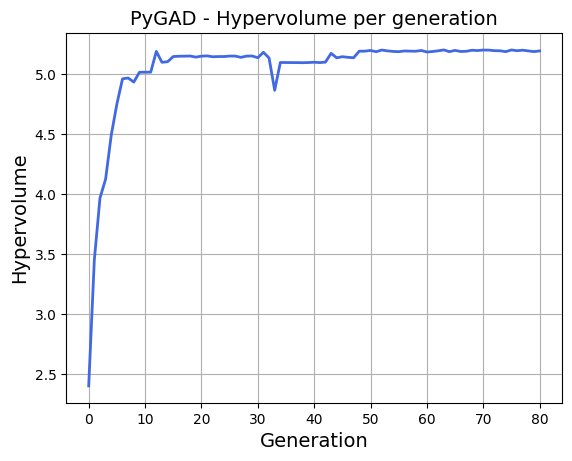

:::{python-examples}
plots/example_plot_non_dominated_hypervolume.py
:::

## `plot_population_diversity()`

Mean pairwise Euclidean distance between solutions per generation. A drop signals the population is converging or collapsing into duplicates. Requires `save_solutions=True`.

Parameters: `title`, `xlabel`, `ylabel`, `font_size`, `color`, `linewidth`, `grid`, `save_dir`.

```python
ga_instance.plot_population_diversity()
```

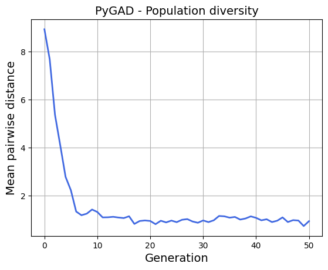

:::{python-examples}
plots/example_plot_population_diversity.py
:::

## `plot_pareto_front_evolution()`

Overlays the non-dominated set every `every_k` generations on a single figure. The colormap goes from early to late so you can see the front converge. Works for 2 or 3 objectives. Requires `save_solutions=True`.

Parameters: `every_k`, `title`, `xlabel`, `ylabel`, `zlabel`, `font_size`, `cmap`, `marker`, `alpha`, `grid`, `save_dir`.

```python
ga_instance.plot_pareto_front_evolution(every_k=20)
```

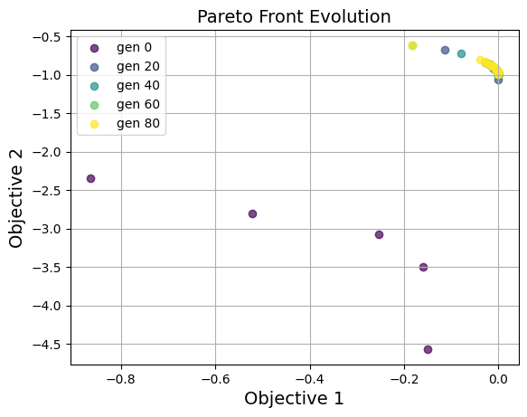

:::{python-examples}
plots/example_plot_pareto_front_evolution.py
:::
